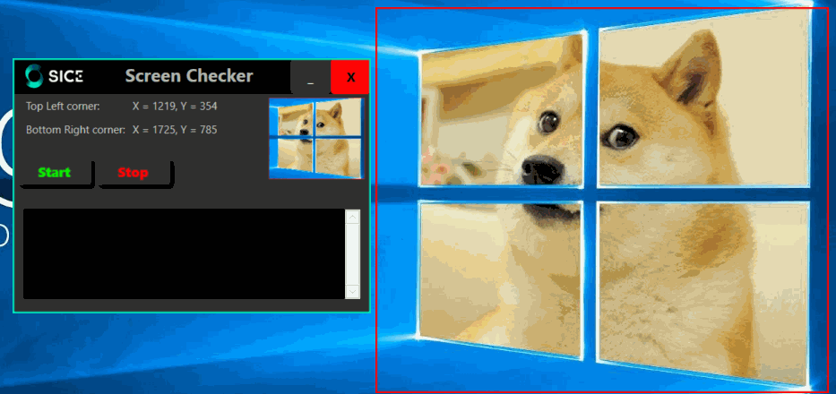

# ScreenCheckerNET

## What this is

A handy .NET tool to capture the time of any change on any section of the screen.

## Usage

- Press Space and drag the mouse the define the region to be monitored.
- Click the start button to start monitoring.
- Any change will be capture in the folder "Proofs" inside the directory where the tool executes.

